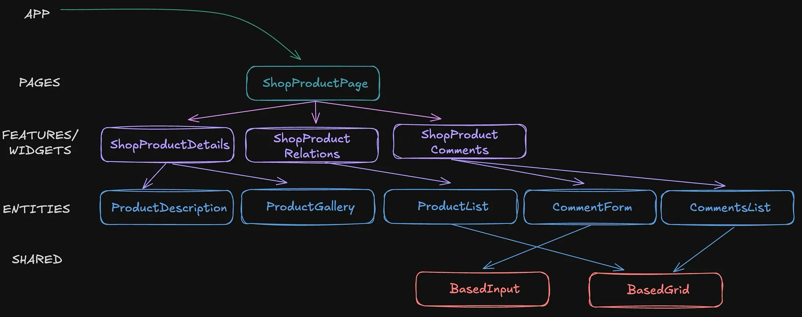
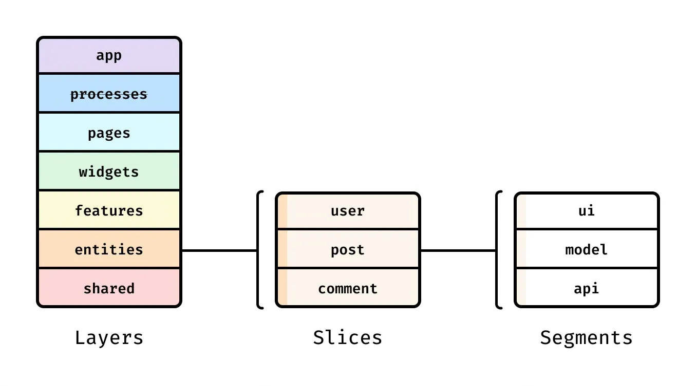
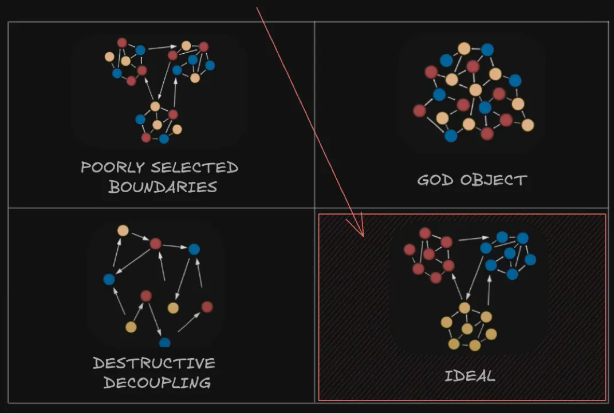
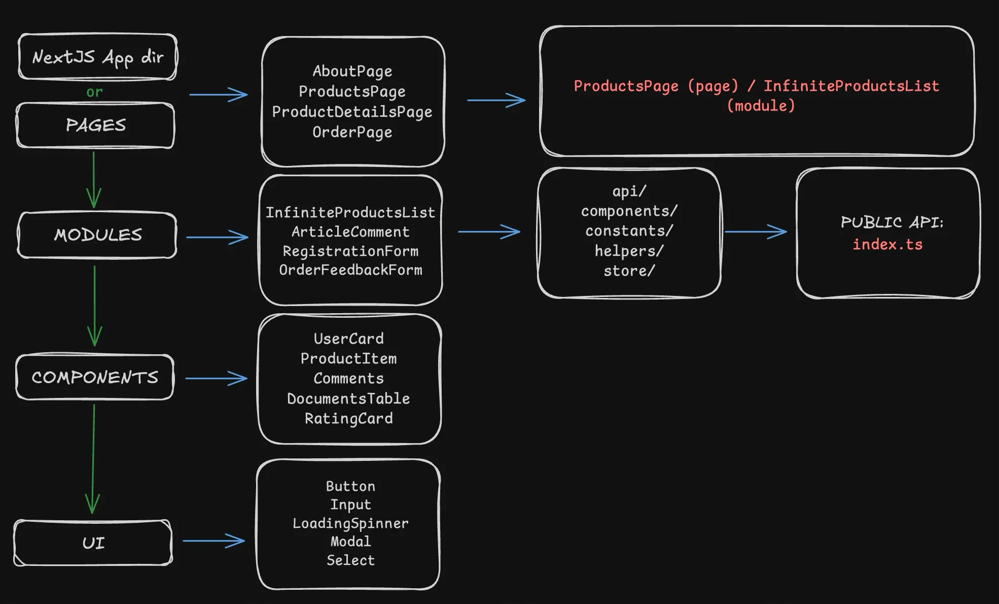

# Sobre a arquitetura desse projeto:

#### Links

https://blog.meetbrackets.com/architectures-of-modern-front-end-applications-8859dfe6c12e

### Module

Um módulo é uma unidade independente do sistema que agrupa funcionalidades relacionadas a um domínio específico.

Ele encapsula features que pertencem ao mesmo contexto.
Pode conter APIs, componentes, estados, hooks, serviços e páginas específicas do domínio.
Geralmente, segue o conceito de alta coesão e baixo acoplamento.

✅ Exemplos de módulos no e-commerce:

authentication → Gerencia login, registro, recuperação de senha.
products → Gerencia catálogo, detalhes, recomendações, avaliações.
checkout → Gerencia carrinho, pagamentos, finalização de pedido.

### Feature

Uma feature é uma funcionalidade específica dentro de um módulo.

Representa um caso de uso do usuário dentro do domínio.
Cada feature pode ter componentes, APIs, hooks e páginas próprias.
Geralmente, não precisa conhecer outras features dentro do módulo.
✅ Exemplos de features no módulo products:

listing → Página com a listagem de produtos.
details → Página de detalhes de um produto específico.
reviews → Exibe e permite a avaliação de produtos.
recommendations → Sugere produtos relacionados.

- https://feature-sliced.design/

📌 Módulo: store

A store parece ser responsável pela exibição de produtos e possivelmente pelo gerenciamento do catálogo. Outras features relevantes para um e-commerce poderiam ser:

📂 store/features

📂 cart/ → Carrinho de compras
📂 components/ → Botão "Adicionar ao Carrinho", Resumo do Carrinho
📂 pages/ → Página do Carrinho (cart.tsx)
📂 checkout/ → Processo de compra
📂 components/ → Resumo do Pedido, Formulário de Pagamento
📂 pages/ → Página de Checkout (checkout.tsx)
📂 orders/ → Pedidos do usuário
📂 components/ → Lista de Pedidos, Detalhes do Pedido
📂 pages/ → Página de Pedidos (orders.tsx)

📌 Módulo: user (Gerenciamento de usuários e perfis)

Para separar funcionalidades relacionadas ao usuário (perfil, histórico de compras, endereços, etc.), pode ser interessante criar um módulo específico:

📂 modules/user/

📂 features/
📂 profile/ → Perfil do usuário
📂 addresses/ → Endereços salvos
📂 wishlist/ → Lista de desejos
📌 Módulo: admin (Se houver um painel administrativo)

Caso o e-commerce tenha um dashboard para gestão de produtos e pedidos, esse módulo pode ser útil:

📂 modules/admin/

📂 features/
📂 dashboard/ → Painel administrativo
📂 products-management/ → CRUD de produtos
📂 orders-management/ → Gestão de pedidos

3️⃣ Quando "Products" deveria ser um Módulo Independente?
Se products lida com dados, regras de negócio e integrações externas, ele deveria ser um módulo próprio, separado da store. Algo como:

📂 modules/products/

📂 features/
📂 catalog/ → Gerenciamento do catálogo de produtos
📂 reviews/ → Avaliações de produtos
📂 service/
🟦 productApi.ts → Chamadas de API para obter produtos
🟦 types.ts → Tipagem de Product, Category
Dessa forma, products não estaria acoplado à exibição (store), permitindo mais reuso e escalabilidade.

<!-- Importantes -->

- https://youtu.be/2RDuyw-NdDU

### Techs

- React Hook Forms, Zod
- Redux, Redux Toolkit, Redux Persist
- React Query, Next Cache
- Axios, Fetch

### Examples

https://github.com/kyprogramming/shoes-store
https://github.com/TheOrcDev/orcish-products/tree/main
https://github.com/ski043/ShoeMarshal/tree/main
https://github.com/peterlidee/searchparams-next-15/tree/main
https://github.com/vercel/commerce/tree/main
https://nextjs.org/docs/app/building-your-application/upgrading/version-15#params--searchparams
https://github.com/AviAvinav/medusa-remix-ecommerce
https://medusajs.com/
https://medusajs.com/v2-overview/
https://medusajs.com/product-module/
